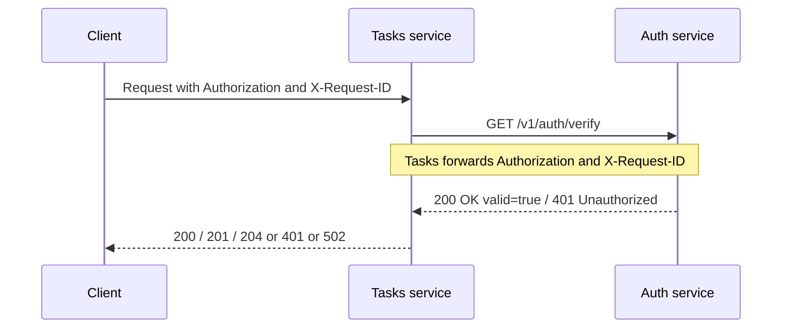
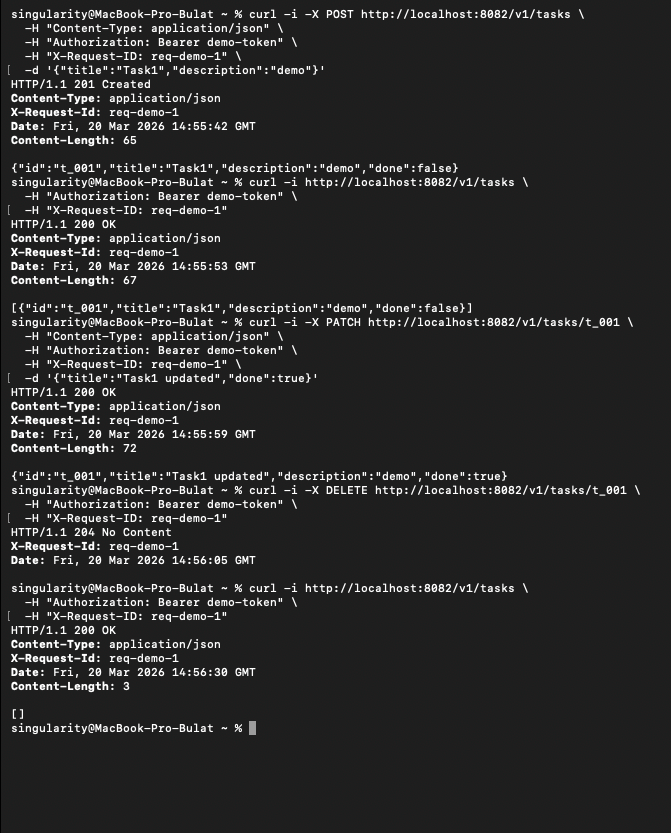
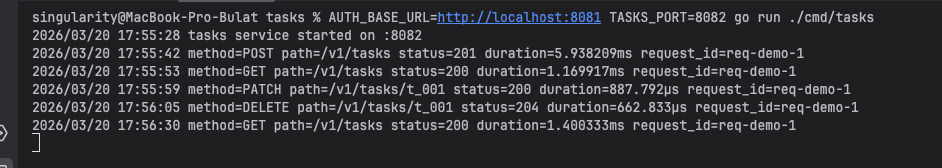
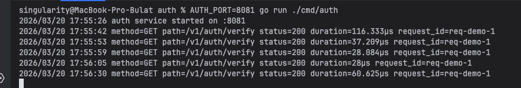

# Практическое занятие №1
# Саттаров Булат Рамилевич ЭФМО-01-25
# Разделение монолита на 2 микросервиса. Взаимодействие через HTTP

### Требования

Для запуска проекта необходимо:

- установленный Go
- доступный `curl`
- свободные порты `8081` и `8082`

### Запуск
Запуск Auth Service
Из корня проекта выполнить:

```bash
cd services/auth
AUTH_PORT=8081 go run ./cmd/auth
```
Запуск Tasks Service
```bash
cd services/tasks
AUTH_BASE_URL=http://localhost:8081 TASKS_PORT=8082 go run ./cmd/tasks
```

Получить токен:
```bash
curl -i -X POST http://localhost:8081/v1/auth/login \
  -H "Content-Type: application/json" \
  -H "X-Request-ID: req-001" \
  -d '{"username":"student","password":"student"}'
```


---

## 1. Короткое описание границ сервисов

В системе выделены два отдельных сервиса.  
`Auth service` отвечает только за упрощённую авторизацию и проверку токена.  
Он предоставляет endpoint для получения токена и endpoint для его верификации.  
`Tasks service` отвечает только за операции с задачами, то есть создание, получение, обновление и удаление.  
`Tasks service` не содержит собственной логики проверки токена и перед каждой защищённой операцией обращается в `Auth service`.  
Такое разделение позволяет отделить логику доступа от бизнес-логики работы с задачами.  
Взаимодействие между сервисами выполняется по HTTP с ограничением по времени ожидания.  
Для трассировки запросов используется заголовок `X-Request-ID`, который передаётся от клиента в `Tasks`, а затем из `Tasks` в `Auth`.

---

Структура проекта
```
pr1/
  README.md
  go.work
  docs/
    pz17_api.md
  shared/
    go.mod
    middleware/
      requestid.go
      logging.go
    httpx/
      client.go
  services/
    auth/
      go.mod
      cmd/auth/main.go
      internal/
        http/
          handler.go
          router.go
        service/
          model.go
          service.go
    tasks/
      go.mod
      cmd/tasks/main.go
      internal/
        client/
          authclient/
            client.go
        http/
          handler.go
          router.go
        service/
          model.go
          service.go
          store.go
```

## 2. Схема взаимодействия



## 3. Список эндпоинтов (Auth и Tasks)

Во всех запросах используется заголовок:
```
Authorization: Bearer <token>
```
## Auth service

### **POST /v1/auth/login**

- Назначение: получение токена по логину и паролю.
- Используется для имитации авторизации пользователя.

### GET /v1/auth/verify

- Назначение: проверка валидности токена.
- Используется сервисом Tasks перед выполнением защищённых операций.

## Tasks service

## POST /v1/tasks

- Назначение: создание новой задачи.
- Перед выполнением вызывает Auth service для проверки токена. 

## GET /v1/tasks

- Назначение: получение списка всех задач.
- Доступен только при валидном токене.

## GET /v1/tasks/{id}
- Назначение: получение конкретной задачи по идентификатору.

## PATCH /v1/tasks/{id}

- Назначение: частичное обновление задачи.
- Позволяет изменить поля title, description, due_date, done.

## DELETE /v1/tasks/{id}

- Назначение: удаление задачи.

---

## 4. Демонстрация работы CRUD и прокидывания X-Request-ID
Для демонстрации работы системы были выполнены операции:

- создание задачи (POST)
- получение списка задач (GET)
- обновление задачи (PATCH)
- удаление задачи (DELETE)

Во всех запросах использовался один и тот же заголовок:
X-Request-ID: req-demo-1

## Запросы


## Логи Task Service


## Логи Auth Service


Можно заметить, что request_id прокидывается успешно


